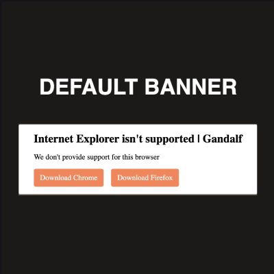

<p align="center">


</p>
<p align="center">INTERNET EXPLORER BLOCKER | Gandalf</p>

# Why
Block users that still use Internet Explorer or older browser with a simply banner, all in 1.1kb gziped.

## How use gandalf
Grab the lib and use with nomodule attribute
```html
<script nomodule src="path/to/gandalf.js" >
```

If you want use fallback style import also stylesheet
```html
<link rel="stylesheet" href="path/to/gandalf.css">
```



## Customize Content
Add script with defer attribute on footer
```javascript
 let settings = {
      "content":{
        "title": "Internet Explorer isn't supported | Gandalf",
        "explanation": "We don't provide support for this browser",
      },
      "browsers": [
          {
            "name": "Chrome",
            "link": "https://www.google.com/intl/en/chrome/",
            "download_text": "Download Chrome",
            "classes": ["btn","btn-primary","btn-primary--chrome"]
          },
          {
            "name": "Firefox",
            "link": "https://www.mozilla.org/firefox/new/",
            "download_text": "Download Firefox",
            "classes": ["btn","btn-primary"]
          }
      ],
      "styles":{
        "wrapper": ["ieblocker__wrapper"],
        "modal": ["ieblocker__modal"],
        "buttons_wrapper": ["ieblocker__buttons-wrapper"]
      }
    };

    blockIe(settings);
```
Change title and explanation values, add or remove supported browsers

## Why nomodule attribute
With nomodule attribute we can target only browser that don't support type module.
According to caniuse, nomodule ,affects Internet Explorer 6-11, Opera Mini, Opera Mobile, UC Browser, and major browser with lower usage.

On browser that support type module, script with nomodule attribute is not downloaded and executed, saving bandwidth.

### Why vhtml
i have choosed vhtml for extendebility, jsx familiar, users can expand functionality and customize layout.

### How customize css
You can pass specific array with your classes for wrapper, modal and buttons wrapper

```javascript
    let settings = {
      "styles":{
        "wrapper": ["your-specific-wrapper-class","more-class-wrapper"],
        "modal": ["your-specific-modal-class"],
        "buttons_wrapper": ["your-specific-buttons-class"]
      }
    };
    
    blockIe(settings)
```

Gandalf provide default classes for wrapper, modal and buttons wrapper
```javascript
    let settings = {
      "styles":{
        "wrapper": ["ieblocker__wrapper"],
        "modal": ["ieblocker__modal"],
        "buttons_wrapper": ["ieblocker__buttons-wrapper"]
      }
    };
    
    blockIe(settings)
```
